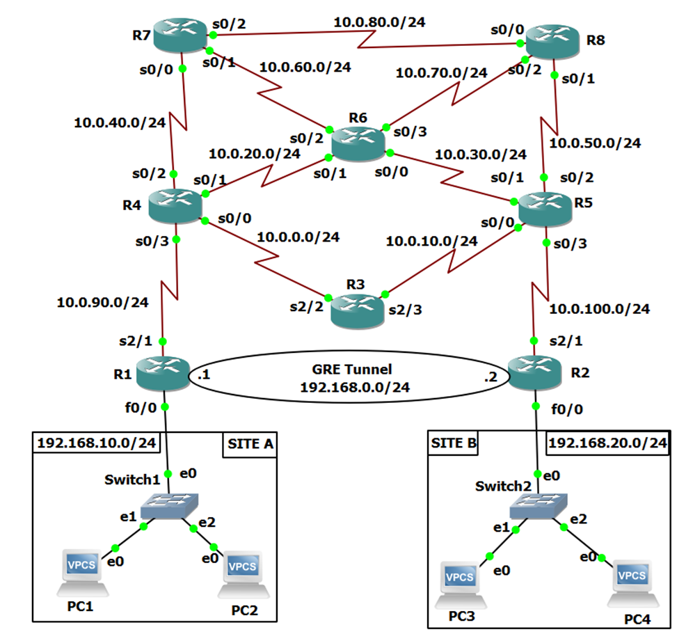
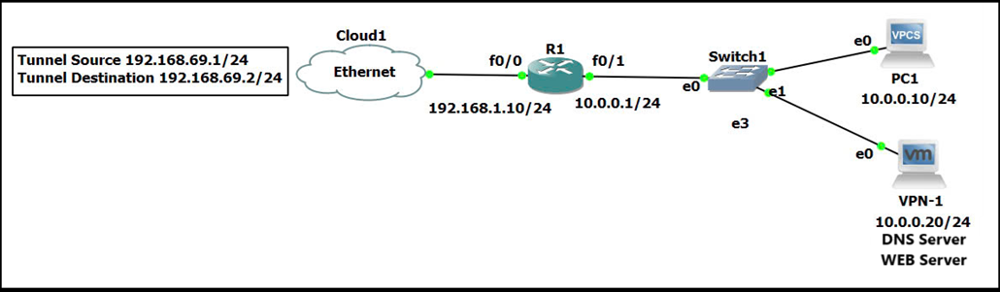
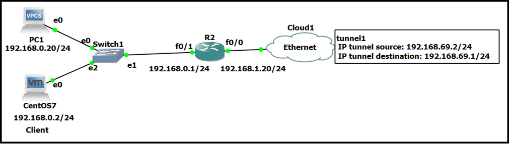

# Cấu hình VPN Gre Tunnel kết hợp IPSec
## Nội dung
  - **I. Cấu hình trên GNS3**
    - **1. Cấu hình OSPF**
    - **2. Cấu hình Tunnel**
    - **3. Cấu hình Static Route cho Tunnel**
    - **4. Cấu hình IPSec**
  - **II. Thực hiện thông qua dây mạng LAN kết nối 2 thiết bị**
    - **1. Cấu hình Tunnel**
    - **2. Cấu hình Static Route cho Tunnel**
    - **3. Cấu hình IPSec**
    
## I. Cấu hình trên GNS3
- Topology demo như sau:
- Hình topology dùng để demo 
### 1. Cấu hình OSPF
  - Với sơ đồ mạng trên, ta thực hiện cấu hình OSPF trên 8 router với Process ID OSPF là 1, Area là 100.
  - Trên R1
  ```
        SITE-A# conf t
        SITE-A(config)# router ospf 1
        SITE-A(config)# net 192.168.10.0 0.0.0.255 area 100
        SITE-A(config)# net 10.0.90.0 0.0.0.255 area 100
  ```
  - Trên R2
  ```
        SITE-B# conf t
        SITE-B(config)# router ospf 1
        SITE-B(config)# net 192.168.20.0 0.0.0.255 area 100
        SITE-B(config)# net 10.0.100.0 0.0.0.255 area 100
  ```
  - Trên R3
  ```
        R3#conf t
        R3(config)# router ospf 1
        R3(config)# net 10.0.0.0 0.0.0.255 area 100
        R3(config)# net 10.0.10.0 0.0.0.255 area 100
  ```
  - Trên R4
  ```
        R4#conf t
        R4(config)# router ospf 1
        R4(config)# net 10.0.0.0 0.0.0.255 area 100
        R4(config)# net 10.0.20.0 0.0.0.255 area 100
        R4(config)# net 10.0.40.0 0.0.0.255 area 100
        R4(config)# net 10.0.90.0 0.0.0.255 area 100
  ```
  - Trên R5
  ```
        R5#conf t
        R5(config)# router ospf 1
        R5(config)# net 10.0.10.0 0.0.0.255 area 100
        R5(config)# net 10.0.30.0 0.0.0.255 area 100
        R5(config)# net 10.0.50.0 0.0.0.255 area 100
        R5(config)# net 10.0.100.0 0.0.0.255 area 100
  ```
  - Trên R6
  ```
        R6#conf t
        R6(config)# router ospf 1
        R6(config)# net 10.0.20.0 0.0.0.255 area 100
        R6(config)# net 10.0.30.0 0.0.0.255 area 100
        R6(config)# net 10.0.60.0 0.0.0.255 area 100
        R6(config)# net 10.0.70.0 0.0.0.255 area 100
  ```
  - Trên R7
  ```
        R7#conf t
        R7(config)# router ospf 1
        R7(config)# net 10.0.40.0 0.0.0.255 area 100
        R7(config)# net 10.0.60.0 0.0.0.255 area 100
        R7(config)# net 10.0.80.0 0.0.0.255 area 100
  ```
  - Trên R8
  ```
        R8#conf t
        R8(config)# router ospf 1
        R8(config)# net 10.0.50.0 0.0.0.255 area 100
        R8(config)# net 10.0.70.0 0.0.0.255 area 100
        R8(config)# net 10.0.80.0 0.0.0.255 area 100
  ```
### 2. Cấu hình Tunnel
  - Thực hiện tạo Tunnel trên 2 router R1 và R2
  - Trên R1 ta cấu hình Tunnel như sau:
  ```
      SITE-A# conf t
      SITE-A(config)# int tunnel 1
      SITE-A(config)# ip address 192.168.0.1 255.255.255.0
      SITE-A(config)# tunnel source 10.0.90.1
      SITE-A(config)# tunnel destination 10.0.100.1
      SITE-A(config)# end
  ```
  - Trên R2 ta cấu hình Tunnel như sau:
  ```
      SITE-B# conf t
      SITE-B(config)# int tunnel 1
      SITE-B(config)# ip address 192.168.0.2 255.255.255.0
      SITE-B(config)# tunnel source 10.0.100.1
      SITE-B(config)# tunnel destination 10.0.90.1
      SITE-B(config)# end
  ```
### 3. Cấu hình Static Route cho Tunnel
  - Ở Router R1 ta cấu hình Static Route để đi vào Site A thông qua Tunnel như sau:
  ```
      SITE-A# conf t
      SITE-A(config)# ip route 192.168.20.0 255.255.255.0 192.168.0.2
  ```
  - Ở Router R2 ta cũng cấu hình Static Route tưởng tự để đi vào Site A như sau:
  ```
      SITE-B# conf t
      SITE-B(config)# ip route 192.168.20.0 255.255.255.0 192.168.0.1
  ```
### 4. Cấu hình IPSec
- Ta tiến hành chia việc cấu hình ra 2 phase gồm Phase 1 nhằm xác thực kết nối và Phase 2 tiến hành mã hóa. Ở trong Phase sẽ tiến hành 2 cách cấu hình là Crypto Map được cài đặt trên cổng Serial 2/1 của router R1 và IPSec Profile được cài đặt trên Tunel 1.
#### PHASE 1 trên R1
  - Đầu tiên Phase 1 trên router R1 được cấu hình như sau:
  ```
    SITE-A# conf t
    SITE-A(config)# crypto isakmp policy 10
    SITE-A(config-isakmp)# encryption aes 256
    SITE-A(config-isakmp)# hash md5
    SITE-A(config-isakmp)# authentication pre-share
    SITE-A(config-isakmp)# group 2
    SITE-A(config-isakmp)# lifetime 3600
    SITE-A(config-isakmp)# exit
    SITE-A(config)# crypto isakmp key password address 10.0.100.1
  ```
#### PHASE 1 trên R2
  - Kế tiếp Phase 1 trên router R2 được cấu hình như sau:
  ```
    SITE-B# conf t
    SITE-B(config)# crypto isakmp policy 10
    SITE-B(config-isakmp)# encryption aes 256
    SITE-B(config-isakmp)# hash md5
    SITE-B(config-isakmp)# authentication pre-share
    SITE-B(config-isakmp)# group 2
    SITE-B(config-isakmp)# lifetime 3600
    SITE-B(config-isakmp)# exit
    SITE-B(config)# crypto isakmp key password address 10.0.90.1
  ```


#### PHASE 2 trên R1
  - Với Phase 2 trên R1 ta có 2 cách cấu hình Crypto Map và IPSec Profile:
  - Ở phần demo nhóm chọn ở cả 2 router đều là IPSec Profile nên sau đây là các câu lệnh cấu hình chi tiết cho 2 cách.
#### CÁCH 1 IPSec Profile (cấu hình chính lúc demo báo cáo)
  ```
    SITE-A(config)# crypto ipsec transform-set GRE esp-aes 256 esp-md5-hmac
    SITE-A(cfg-crypto-trans) mode transport
    SITE-A(cfg-crypto-trans)#exit
    SITE-A(config)#crypto ipsec profile GRE-PROFILE
    SITE-A(ipsec-profile) set transform-set GRE
    SITE-A(ipsec-profile)# exit
  ```
   Bước cuối cùng của Phase 2 trên R2 là thiết lập IPSec Profile lên Tunnel 1
  ```
    SITE-A(config)# int tun1
    SITE-A(config-if)# tunnel protection ipsec profile GRE-PROFILE
  ```
#### CÁCH 2 Crypto Map (xem thêm)
  ```
    SITE-A(config)# crypto ipsec transform-set GRE esp-aes 256 esp-md5-hmac 
    SITE-A(cfg-crypto-trans)# mode transport
    SITE-A(cfg-crypto-trans)# exit
    SITE-A(config)# ip access-list extended GRE-ACL
    SITE-A(config-ext-nacl)# permit gre host 10.0.90.1 host 10.0.100.1
    SITE-A(config-ext-nacl)# exit
    SITE-A(config)# crypto map GRE-CMAP 10 ipsec-isakmp
    SITE-A(config-crypto-map)# match address GRE-ACL
    SITE-A(config-crypto-map)# set transform-set GRE
    SITE-A(config-crypto-map)# set peer 10.0.100.1
    SITE-A(config-crypto-map)# exit
  ```
  Bước cuối cùng là thiết lập Crypto Map lên Interface thích hợp
  ```
    SITE-A(config)# int Serial2/1
    SITE-A(config-if)# crypto map GRE-CMAP
  ```


#### PHASE 2 trên R2
 - Về Phase 2 trên R2 ta cũng có 2 cách cấu hình Crypto Map và IPSec Profile
#### CÁCH 1 IPSec Profile (cấu hình chính lúc demo báo cáo)
  ```
    SITE-B(config)# crypto ipsec transform-set GRE esp-aes 256 esp-md5-hmac
    SITE-B(cfg-crypto-trans) mode transport
    SITE-B(cfg-crypto-trans)#exit
    SITE-B(config)#crypto ipsec profile GRE-PROFILE
    SITE-B(ipsec-profile) set transform-set GRE
    SITE-B(ipsec-profile)# exit
  ```
  Bước cuối cùng của Phase 2 trên R2 là thiết lập IPSec Profile lên Tunnel 1
  ```
    SITE-B(config)# int tun1
    SITE-B(config-if)# tunnel protection ipsec profile GRE-PROFILE
  ```
#### CÁCH 2 Crypto Map (xem thêm)
  ```
    SITE-B(config)# crypto ipsec transform-set GRE esp-aes 256 esp-md5-hmac 
    SITE-B(cfg-crypto-trans)# mode transport
    SITE-B(cfg-crypto-trans)# exit
    SITE-B(config)# ip access-list extended GRE-ACL
    SITE-B(config-ext-nacl)# permit gre host 10.0.100.1 host 10.0.90.1
    SITE-B(config-ext-nacl)# exit
    SITE-B(config)# crypto map GRE-CMAP 10 ipsec-isakmp
    SITE-B(config-crypto-map)# match address GRE-ACL
    SITE-B(config-crypto-map)# set transform-set GRE
    SITE-B(config-crypto-map)# set peer 10.0.90.1
    SITE-B(config-crypto-map)# exit
  ```
  Bước cuối cùng của Phase 2 trên R2 là thiết lập Crypto Map lên Interface thích hợp
  ```
    SITE-B(config)# int Serial2/1
    SITE-B(config-if)# crypto map GRE-CMAP
  ```

## II. Thực hiện thông qua dây mạng LAN kết nối 2 thiết bị (tương tự như trên, xem thêm nếu cần)
- Topology demo như sau:
-  Trên PC1 sẽ dựng một DNS Server kết hợp WEB Server để demo.

-  Trên PC2 dùng một máy ảo đóng vai trò client để test các dịch vụ trên Server được dựng bởi PC1.

### 1. Cấu hình Tunnel
#### Trên R1 ta cấu hình Tunnel như sau:
  ```
      R1# conf t
      R1(config)# int tunnel 1
      R1(config)# ip address 192.168.1.10 255.255.255.0
      R1(config)# tunnel source 192.168.69.1
      R1(config)# tunnel destination 192.168.69.2
      R1(config)# end
  ```
#### Trên R2 ta cấu hình Tunnel như sau:
  ```
      R2# conf t
      R2(config)# int tunnel 1
      R2(config)# ip address 192.168.1.20 255.255.255.0
      R2(config)# tunnel source 192.168.69.2
      R2(config)# tunnel destination 192.168.69.1
      R2(config)# end
  ```
### 2. Cấu hình Static Route cho Tunnel
- Ở PC1 ta cấu hình Static Route để đi vào lớp mạng 192.168.0.0/24 của PC2 thông qua Tunnel như sau:
  ```
      R1# conf t
      R1(config)# ip route 192.168.0.0 255.255.255.0 192.168.69.2
  ```
  - Tương tự ở PC2 ta cũng cấu hình Static Route để đi vào lớp mạng 10.0.0.0/24 của PC1
  ```
      R2# conf t
      R2(config)# ip route 192.168.0.0 255.255.255.0 192.168.69.1
  ```
## III. Cấu hình IPSec
- Tương tự như phần I, phần sẽ tiến hành nhanh như sau:
#### Trên R1 (PC1) CRYPTO MAP
			***PHASE 1***
```
  R1# conf t
  R1(config)# crypto isakmp policy 10
  R1(config-isakmp)#	encryption aes 256
  R1(config-isakmp)#	hash md5
  R1(config-isakmp)#	authentication pre-share
  R1(config-isakmp)#	group 2
  R1(config-isakmp)#	lifetime 3600
  R1(config-isakmp)# exit
  R1(config)#crypto isakmp key 123 address 192.168.1.20
```
			***PHASE 2***
```
  R1# conf t
  R1(config)# crypto ipsec transform-set GRE esp-aes 256 esp-md5-hmac 
  R1(cfg-crypto-trans)#	mode transport
  R1(cfg-crypto-trans)#	exit
  R1(config)# ip access-list extended GRE-ACL
  R1(config-ext-nacl)# permit gre host 192.168.1.10 host 192.168.1.20
  R1(config)#	exit
  R1(config)# crypto map GRE-CMAP 10 ipsec-isakmp
  R1(config-crypto-map)#	match address GRE-ACL
  R1(config-crypto-map)#	set transform-set GRE
  R1(config-crypto-map)#	set peer 192.168.1.20
  R1(config-crypto-map)#	exit
```
		***Bind (ràng buộc) to Interface***
```
  R1(config)# int f0/0
  R1config-if)#	crypto map GRE-CMAP
```

#### Trên R2 (PC2) IPSEC PROFILE
            ***PHASE 1***
  ```
    R2# conf t
    R2(config)# crypto isakmp policy 10
    R2(config-isakmp)# encryption aes 256
    R2(config-isakmp)# hash md5
    R2(config-isakmp)# authentication pre-share
    R2(config-isakmp)# group 2
    R2(config-isakmp)# lifetime 3600
    R2(config-isakmp)# exit
    R2(config)# crypto isakmp key password address 192.168.1.20
  ```
            ***PHASE 2***
  ```
    R2(config)# crypto ipsec transform-set GRE esp-aes 256 esp-md5-hmac
    R2(cfg-crypto-trans) mode transport
    R2(cfg-crypto-trans)#exit
    R2(config)#crypto ipsec profile GRE-PROFILE
    R2(ipsec-profile) set transform-set GRE
    R2(ipsec-profile)# exit
  ```
            ***Bind to Interface***
  ```
    R2(config)# int tun1
    R2(config-if)# tunnel protection ipsec profile GRE-PROFILE
  ```

  Các câu lệnh show ra thông tin cấu hình:
```
show int tun1
show crypto ipsec sa
show crypto ipsec sa | include encrypt|decrypt
show crypto isakmp policy
show crypto ipsec session
show running-config | include (crypto map|ipsec)
trace 192.168.0.20 -P 1
 ```

